<!-- <h2>Hi 👋, I'm reeny </h2>
<h3>Front-End engineer</h3>

  

  
I'm a Frontend Engineer passionate about developing services that alleviate people's discomfort.  
I strive to make a positive impact and dream of a better future for everyone.

  -->

<h3>Connect with me</h3>

  <!-- 
  &nbsp -->
  

 

<h3>Languages and Tools</h3>

 

<h3>Github Stats</h3>

  

<!--  -->
  
  <!-- 
 -->
<!--  -->
<!--  -->

